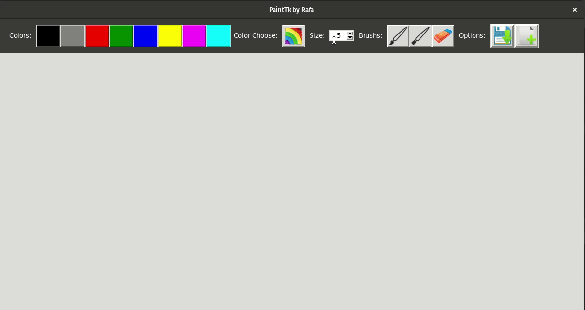

# Paint - tk

Program to draw utilizing tkinter

This is a simple program for execute a similar
paint utilizing the library tkint of python.

Example:

Sites:
[For icons](https://iconarchive.com/)

[For resize icons](https://www.iloveimg.com)